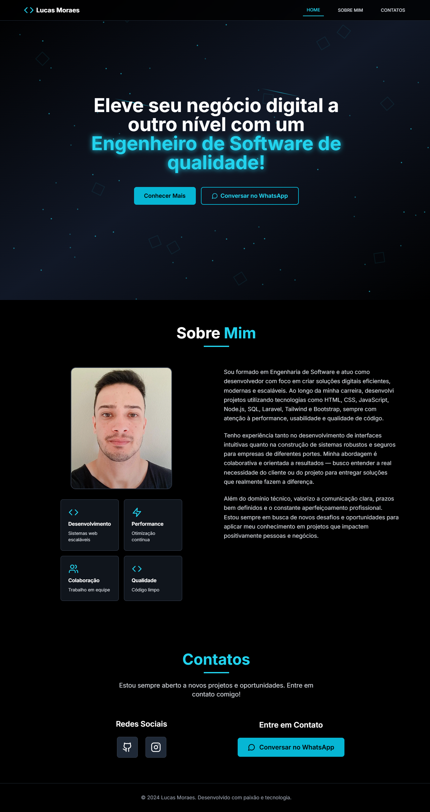

# Landing Page - Lucas Moraes

🚀 **Eleve seu negócio digital a outro nível com um Engenheiro de Software de qualidade!**

Esta é uma landing page moderna e responsiva desenvolvida em React + Vite + Tailwind CSS. Ideal para apresentação profissional de portfólio, serviços ou produtos digitais.

---

## 🛠️ Tecnologias Utilizadas

- [React](https://reactjs.org/)
- [TypeScript](https://www.typescriptlang.org/)
- [Vite](https://vitejs.dev/)
- [Tailwind CSS](https://tailwindcss.com/)
- [Lucide Icons](https://lucide.dev/icons)

---

## ✨ Funcionalidades

- Interface responsiva e rápida
- Scroll suave entre seções
- Ícones modernos com Lucide
- Código limpo e modular
- Foco em performance e usabilidade

---

## 📸 Preview



---

## 📦 Instalação e uso local

```bash
# Clone o repositório
git clone https://github.com/lucasmoraesn/landing-page-lucas.git
cd landing-page-lucas

# Instale as dependências
npm install

# Rode em modo desenvolvimento
npm run dev
